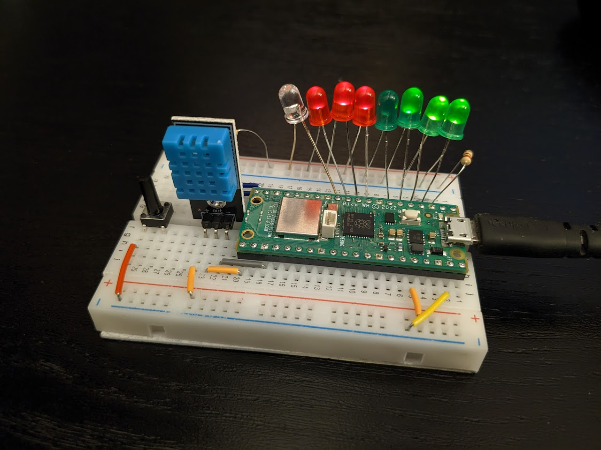

# Raspberry Pi Pico W weather station
This is the code used to control my simple Raspberry Pi Pico W weather station (shown below displaying a temperature of 23 degrees Celsius).

It's the first version of the station - in the future I'm planning on connecting it to WiFi and storing the temperature data somewhere in order to be able to graph it.

## How it works
The station is very simple to use - all you need to do is plug in the USB power and wait for the LEDs to flash (allows you to check whether there are any dead ones), and then press the little button on the left to ask for the temperature reading. You will be greeted with an opening animation, followed by 10s of displaying the temperature as an eight bit float (`f8`, see https://frun36.github.io/mini-float/), 10s of displaying the relative humidity (`f8`, as a fraction instead of percentage) and the closing animation. Should anything go wrong during the measurement process, the orange LED will flash, along with one of the greed LEDs to show the error code. You will then see no closing animation, and will have to ask for the measurement again. 